## 4.1 栏
### 4.1.1 状态栏
状态栏展示了关于设备及其周围环境的重要信息。

默认(深色)内容

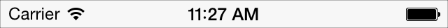

浅色

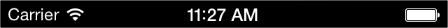

状态栏：

- 是透明的
- 始终固定在整个屏幕的上边缘

API 注释

你可以将全应用的状态栏风格设计成统一的，或者给不同的视图控制器定义不同的状态栏风格。想要了解更多内容，你可以通过 [UIApplication Class Reference](https://developer.apple.com/library/ios/documentation/UIKit/Reference/UIApplication_Class/Reference/Reference.html#//apple_ref/doc/uid/TP40006728) 来了解 [UIStatusBarStyle](https://developer.apple.com/library/ios/documentation/UIKit/Reference/UIApplication_Class/index.html#//apple_ref/c/tdef/UIStatusBarStyle) 常数，以及通过 [UIViewController Class Reference](https://developer.apple.com/library/ios/documentation/UIKit/Reference/UIApplication_Class/Reference/Reference.html#//apple_ref/doc/uid/TP40006728) 来了解更多关于 [preferredStatusBarStyle](https://developer.apple.com/library/ios/documentation/UIKit/Reference/UIViewController_Class/index.html#//apple_ref/occ/instm/UIViewController/preferredStatusBarStyle) 属性的内容。

**不要创建自定义状态栏。**用户依赖系统默认状态栏的一致性。就算你可能会在应用中隐藏它，也不宜定制一个新的 UI 来代替原有系统状态栏。

**避免滚动内容直接透过状态栏显示。**你不会希望用户在滚动的时候看到五花八门的内容和状态栏自身的元素混合在一起。想要让用户感受到内容区域够大的同时，最大限度地保证可读性，请保证在状态栏后面添加一块背景，用以模糊出现在状态栏后的内容。以下有一些方法可以让滚动的内容能正常显示在状态栏后面：

- 使用导航控制器(navigation controller)来展示内容。导航控制器自动展示状态栏背景，同时能确保内容视图不会出现在状态栏后面。（了解更多请参考 [Navigation Controllers](https://developer.apple.com/library/ios/documentation/WindowsViews/Conceptual/ViewControllerCatalog/Chapters/NavigationControllers.html#//apple_ref/doc/uid/TP40011313-CH2)）。
- 在状态栏后面放一个低调的、不会抢走用户注意力的自定义图形——比如一道渐变。想要保证这样的图形始终固定在状态栏后面，你可以用视图控制器(view controller)来让它固定在滚动内容上一层，又或者可以用滚动视图(scrolling view)来保证图形固定在屏幕的顶部。
- 让内容固定在导航栏区域外显示（这个区域由应用的 [statusBarFrame](https://developer.apple.com/library/ios/documentation/UIKit/Reference/UIApplication_Class/index.html#//apple_ref/occ/instp/UIApplication/statusBarFrame) 属性来定义）。如果你确定要这样做的话，请给导航栏区域添加固定的、与屏幕背景色相同的背景色。
**千万千万，避免在状态栏后面叠加会分散注意力的内容。**尤其是，你不能让用户觉得轻击状态栏之后可以获取内容或激活你的应用中的控件。

**隐藏状态栏时请慎重。**由于状态栏是透明的，通常情况下不需要隐藏它。始终隐藏状态栏意味着用户必须退出你的应用才能知道现在的时间，或者了解当前环境下是否有 Wi-Fi 连接。

**在用户全屏观看媒体时，考虑隐藏状态栏以及所有页面 UI。**当你这么做的时候，请确保用户在轻击屏幕时即可重新唤起状态栏以及相关的 UI。而除非你有充分的理由，否则最好不要重新定义一个手势来让用户唤起状态栏，因为用户不会发现，就算发现了也难以记住。

**为你的应用选择配色协调的状态栏颜色。**默认的状态栏内容是黑色的，在浅色应用中效果出色，而相应的浅色状态栏则更适用于颜色较深的应用。

**在适当的时候展示网络活动指示器(network activity indicator)。**这可以提醒用户显示长时间的网络接入状态。更多详情请参考本章第三节控件部分的网络活动指示器部分([Network Activity Indicator](https://developer.apple.com/library/ios/documentation/UserExperience/Conceptual/MobileHIG/Controls.html#//apple_ref/doc/uid/TP40006556-CH15-SW44))。

### 4.1.2 导航栏
导航栏能够实现在应用不同信息层级结构间的导航，有时候也可用于管理当前屏幕内容。

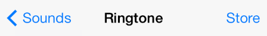
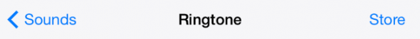

导航栏：

- 是半透明的
- 通常位于屏幕的上方，状态栏正下方。在横屏视图中，导航栏也可以包含在某一视图中，不需要与整个屏幕等宽，比如说它可以出现在对分视图控制器(split view controller)的其中一侧。
- 当键盘被唤起、用户使用了手势、或者当前视图变为竖屏的情况下，导航栏可以隐藏。
- 可以填充颜色(使用 [tintColor](https://developer.apple.com/library/ios/documentation/UIKit/Reference/UIBarButtonItem_Class/index.html#//apple_ref/occ/instp/UIBarButtonItem/tintColor) 来定义导航栏中的图标与文字颜色；使用 [barTintColor](https://developer.apple.com/library/ios/documentation/UIKit/Reference/UINavigationBar_Class/index.html#//apple_ref/occ/instp/UINavigationBar/barTintColor) 来填充导航栏背景色)

API 注释

导航栏包含于导航控制器（一个管理显示自定义视图层级结构的程序对象）中。想要了解更多关于如何在代码中定义一个导航栏的信息，请参阅 [Navigation Controllers](https://developer.apple.com/library/ios/documentation/WindowsViews/Conceptual/ViewControllerCatalog/Chapters/NavigationControllers.html#//apple_ref/doc/uid/TP40011313-CH2), [UINavigationController Class Reference](https://developer.apple.com/library/ios/documentation/UIKit/Reference/UINavigationController_Class/index.html#//apple_ref/doc/uid/TP40006934) 和 [UINavigationBar Class Reference](https://developer.apple.com/library/ios/documentation/UIKit/Reference/UINavigationBar_Class/index.html#//apple_ref/doc/uid/TP40006887).

你可以用导航栏在不同视图间提供导航，或在上面放置管理当前视图内容的相关控件。如果你需要提供导航栏难以承载的大量控件同时又不是非要提供导航不可，你可以考虑使用工具栏(Toolbar)。

当用户到达一个新的层级，导航栏需要做出这样的改变：

- 导航栏标题应该变成当前层级的标题。
- 当前标题左侧放置应有返回按钮，需要的话，返回按钮可以以前一层级的标题命名。
 **使用当前视图的标题作为导航栏标题。**若觉得标题冗余，你也可以将标题留空。举个例子，备忘录的导航栏中就没有当前备忘录的标题，因为备忘录的第一行就已经提供了所有用户需要的内容。

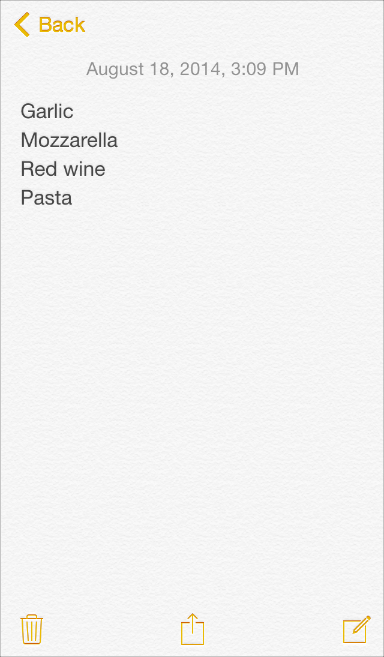

**考虑在应用最高层级的导航栏中放置一个分段控件。**它能够帮助你更好地扁平信息层级，也会让用户更容易找到所需内容。如果在导航栏中使用了分段控件，请确保返回按钮标题命名的准确。（更多使用指引请参阅本章第三节中的分段控件。）

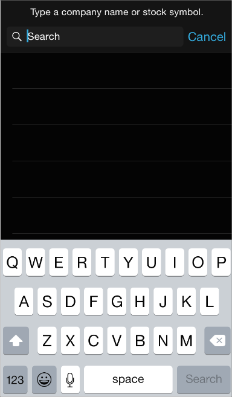

如果需要的话，可以考虑在导航栏位置使用提示语(prompt)来告诉用户在当前屏幕中他们可以做什么。提示语是一句出现在导航栏顶部的短句。举个例子，股票应用(Storcks)中就给用户提供了这么一句提示，来确保用户知道怎么去搜索自己想要的信息。

如果你需要用到提示语，请设计一句简明扼要的单句，并在句末配以适当的标点符号。

**即使空间充足，也应当避免让过多的控件填满你的导航栏。**一般来说，导航栏上应该不多于以下三个元素：当前视图的标题、返回按钮和一个针对当前的操作控件。而当你在导航栏中使用了分段控件，就不要再放标题以及其它多余控件了。

**确保文字按钮之间拥有足够的空间。**如果导航栏左边或右边的文字按钮之间的间距太小，那些文字看起来会像挤在一起一样，让用户难以区分。如果按钮在导航栏中显得太过拥挤，你可以使用 UIBarButtonSystemItemFixedSpace 常数来给他们增加适当的间距。（想要了解更多关于这个常数的内容，请参考 [UIBarButtonItem Class Reference](https://developer.apple.com/library/ios/documentation/UIKit/Reference/UIBarButtonItem_Class/index.html#//apple_ref/doc/uid/TP40007519).）

**确保你自定义的导航栏在你的应用的每个视图中都拥有一致的外观与体验。**举个例子，不要在同一个应用中使用不透明导航栏和半透明工具栏。在屏幕处于同一方向时，最好不要改变不同屏上导航栏的背景图片、颜色和透明度。

**确保你自定义的返回按钮的外观与操作仍然像一个返回按钮。**用户知道系统默认的返回按钮能帮助他们在信息层级中追踪自己的路径，如果你想重新设计它，请确保使用一个自定义的蒙版图层 (custom mask image)，它可以在 iOS 中让这些按钮标题在系统各转场中出现或者消失。

重要

不要创建多段式(multisegment)返回按钮。返回按钮通常是用来帮助用户回到当前层级的父层级中去的。如果你担心用户在没有了这种多节式的、如同面包屑一般的返回按钮后会迷路，那么你也许该好好考虑如何扁平你的信息层级了。

**在用户需要专注于内容的时候，可以考虑隐藏导航栏。**当你这么做的时候，请确保用户通过一个简单的手势（比如一下轻击）即可重新唤起导航栏。

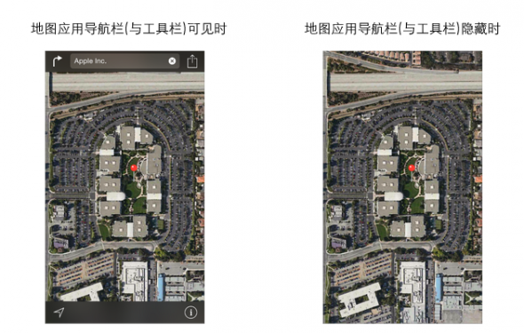

### 4.1.3 工具栏
工具栏上放置着用于操作当前屏幕中各对象的控件。

工具栏：

- 是半透明的
- 在 iPhone 上，工具栏始终位于屏幕底部，而在 iPad 上则有可能出现在顶部
- 当键盘被唤起、用户使用了手势、或者当前视图变为竖屏的情况下，工具栏可以隐藏。
API 注释

工具栏包含在导航控制器(navigation controller)中，该控制器用于管理定制视图中信息层级的展示形式。 想要了解如何在代码中定义工具栏，请参考 [Displaying a Navigation Toolbar](https://developer.apple.com/library/ios/documentation/WindowsViews/Conceptual/ViewControllerCatalog/Chapters/NavigationControllers.html#//apple_ref/doc/uid/TP40011313-CH2-SW4) 以及 [UIToolbar Class Reference](https://developer.apple.com/library/ios/documentation/UIKit/Reference/UIToolbar_Class/index.html#//apple_ref/doc/uid/TP40006927).

你可以在工具栏里提供一系列让用户对当前视图内容进行操作的工具。

**在工具栏里放置用户在当前情景下最常用的指令。**尽量避免在工具栏里提供一些仅会偶尔用到的指令。

**可以在工具栏里放置分段控件以方便用户快速切换当前内容的不同视图或模式。**在工具栏中提供应用全局的任务或者模式分段控件是不恰当的，因为工具栏中的所有操作都应当是针对当前屏幕和视图的。如果你需要让用户可以快速唤起应用全局的任务、或改变全局视图和模式，可以使用标签栏(Tab Bar)。想要了解更多分段控件的内容，请参考下文的分段控件(Segmented Control)部分；想要了解更多标签栏的内容，请参考下文中的标签栏(Tab Bar)部分。

**如果需要在工具栏上展示3个以上的项目，可以使用图标。**由于文本按钮通常会比图标更占空间，所以用图标可以避免文字标题们挤在一起。

**保证工具栏文字按钮之间有足够的间距。**如果按钮之间间距过小，会让蚊子看起来挤在一起，让用户觉得它们难以区分。如果按钮在导航栏中显得太过拥挤，可以用 UIBarButtonSystemItemFixedSpace 常数来增加他们之间的间距。（想要了解更多关于这个常数的内容，请参考 [UIBarButtonItem Class Reference](https://developer.apple.com/library/ios/documentation/UIKit/Reference/UIBarButtonItem_Class/index.html#//apple_ref/doc/uid/TP40007519).）

### 4.1.4 工具栏与导航标准按钮
iOS 提供了一系列工具栏与导航栏上的内置标准按钮。想要了解如何设计自定义图标，请参考本文第五章栏按钮图标(Bar Button Icons)部分。工具栏和导航栏图标的颜色可以通过 tintColor 属性来设定。

想要了解每一个按钮所对应的标志名称及其含义，请参阅 [UIBarButtonItem Class Reference](https://developer.apple.com/library/ios/documentation/UIKit/Reference/UIBarButtonItem_Class/Reference/Reference.html#//apple_ref/doc/uid/TP40007519) 中的 [UIBarButtonSystemItem](https://developer.apple.com/library/ios/documentation/UIKit/Reference/UIBarButtonItem_Class/Reference/Reference.html#//apple_ref/c/tdef/UIBarButtonSystemItem) 部分。

重要

跟所有标准按钮和图标相同，应当根据文档中说明的图标含义，而不是只凭图标外观来使用这些工具栏图标和导航栏图标。这样能够保证在关联特定意义的按钮改变了外观的情况下，你的应用中的 UI 仍然是可用而有意义的。

表格 **41-1 工具栏与导航栏标准按钮 **(Standard buttons available for toolbars and navigation bars)

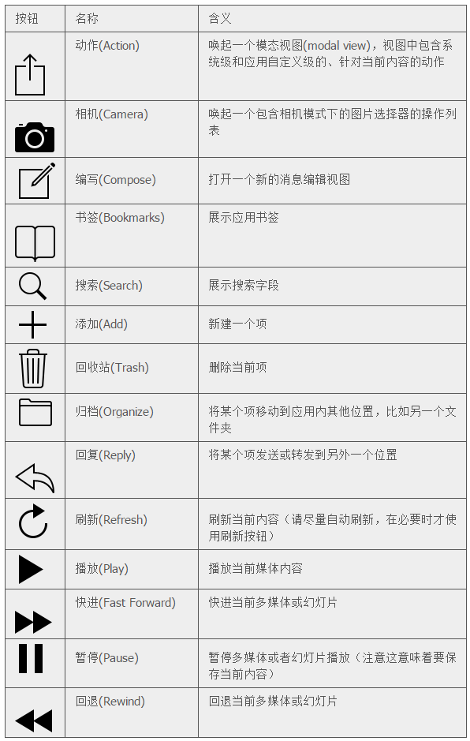

除了表格41-1里展示的标准按钮之外，你还可以使用系统提供的编辑、取消、保存、完成、撤销、重做等等按钮来支持编辑或其它操作。这些按钮的标题即是按钮的操作内容。想要了解每一个按钮的名称及其含义，请参阅 [UIBarButtonItem Class Reference](http://www.cocoachina.com/newbie/basic/2013/0819/6827.html) 中的 [UIBarButtonSystemItem](https://developer.apple.com/library/ios/documentation/UIKit/Reference/UIBarButtonItem_Class/Reference/Reference.html#//apple_ref/c/tdef/UIBarButtonSystemItem).
另外，你还可以在工具栏中放置系统提供的信息按钮(info button).

### 4.1.5 标签栏
标签栏让用户在不同的子任务、视图和模式中进行切换。

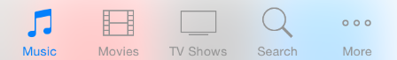

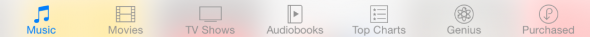

API 注释

标签栏包含在标签栏控制器中，该控制器用于管理自定义视图的展示形式。想要了解如何在代码中定义标签栏，请参考 [Tab Bar Controllers](https://developer.apple.com/library/ios/documentation/WindowsViews/Conceptual/ViewControllerCatalog/Chapters/TabBarControllers.html#//apple_ref/doc/uid/TP40011313-CH3) 和 [UITabBar](https://developer.apple.com/library/ios/documentation/UIKit/Reference/UITabBar_Class/index.html#//apple_ref/occ/cl/UITabBar).

标签栏位于屏幕底部，并应该保证在应用内任何位置都可用。标签栏是半透明的，展示图标和文字内容，每一项均保持等宽。当用户选中某个标签时，该标签呈现适当的高亮状态。

标签栏：

- 是半透明的
- 始终出现在屏幕的底部
- 一个标签栏一次最多可承载5个标签（多于5个标签的时候，可以展示前4个标签和一个“更多”，并将其他的标签以列表形式收纳到“更多”里面）
- 在横屏与竖屏情况下，高度均保持一致
- 你可以在标签上加上红底白字，显示数字或者省略号的小气泡(badge)以展示特定的应用信息
你可以使用标签栏来切换对同一组数据的不同视图模式，或者整体功能下不同的子任务。

**一般而言，使用标签栏来组织整个应用层面的信息结构。**标签栏非常适合用于应用的主界面中，因为它可以很好地扁平信息层级，并且同时提供多个触达同级信息类目与模式的入口。

**不要使用标签来让用户执行对于当前应用与屏幕内容的操作。**如果你需要给用户提供操作控件，请使用工具栏。

**即使标签当前不可用，也不要把它从标签栏中删除。**让某些标签时而出现时而隐藏，会让用户觉得你的应用 UI 不稳定而且难以预测。最好的解决方式是确保每个标签都可用，然后给用户解释某个标签的内容不可用的原因。举个例子，当用户没有在设备中保存任何歌曲，在系统音乐应用的歌曲标签页里就可以教育用户如何去下载一首歌。

**考虑在 tab 上加入红色的小气泡(Badge)以低调地传达信息。**你可以通过添加小气泡来告知用户该标签中包含新的内容。

**根据控件的标准含义来选择系统提供的图标。**详情请查看下文中的标签栏标准图标(Tab Bar Icons)。如果想自定义标签栏图标，请参考文档第五章中 Bar Buttons Icons 里给出的建议。

**在横屏视图中，你可能会在对分视图(split view pane)或者浮出层(popover)内使用标签栏以切换或筛选视图中的内容。**如果这些标签是用于切换或者过滤当前视图中的内容的话，你可以这么做。然而通常情况下，在对分视图和浮出层底部使用分段控件效果会更好，因为视觉上看起来更为协调。更多详情请参考文档本章第三节中的分段控件。

**避免让过多的标签填满你的标签栏。**放置太多标签会让用户难以选中他想要点击的那一个。而同时每添加一个标签，意味着你的应用程序又复杂了一分。

**尽可能地在横屏与竖屏情况下都展示相同数量的标签。**在不同的屏幕方向下提供同样的标签可以让用户对应用建立很好的视觉稳定感。在横屏中，你应该将与竖屏时数量相同的标签居中展示。**在横屏中，避免使用“更多”标签。**如果应用是横屏的，那么把额外的操作都塞到一个“更多”里面是对空间一种糟糕的浪费。

### 4.1.6 标签栏标准图标
iOS 提供了一系列标签栏标准图标，在下面的表格35-2中有详细展示。想要了解如何设计自定义图标，请参考文档第五章栏标准按钮部分。标签栏图标的颜色可以通过 [tintColor](https://developer.apple.com/library/ios/documentation/UIKit/Reference/UIView_Class/index.html#//apple_ref/occ/instp/UIView/tintColor) 属性来设定。

想要了解每一个图标的名称及其含义，请参阅 [UIBarItem Class Reference](https://developer.apple.com/library/ios/documentation/UIKit/Reference/UITabBarItem_Class/Reference/Reference.html#//apple_ref/doc/uid/TP40006928) 中的 [UITabBarSystemItem](https://developer.apple.com/library/ios/documentation/UIKit/Reference/UITabBarItem_Class/index.html#//apple_ref/c/tdef/UITabBarSystemItem) 部分。

重要

跟所有的标准按钮与图表相同，根据文档说明的图表含义而不是仅凭图表外观来使用这些图标是很关键的。这样能够保证在关联特定含义的按钮改变了外观的情况下，你的应用中的 UI 仍然是可用而有意义的。

表格 **41-2 标签栏标准按钮 **(Standard icons for use in the tabs of a tab bar)

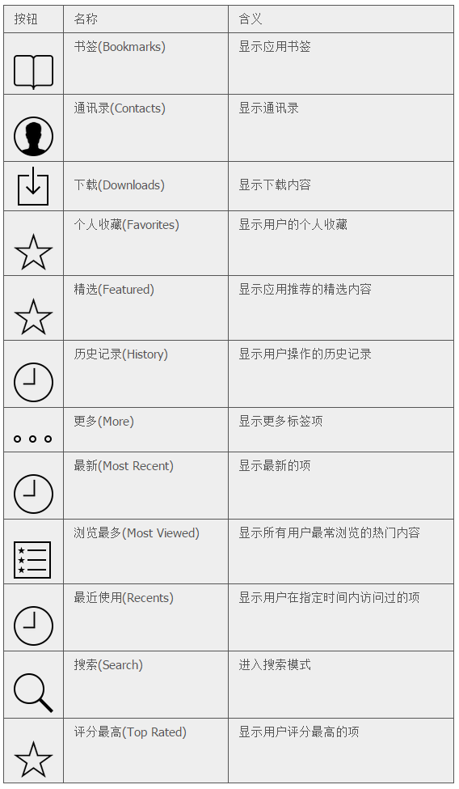

### 4.1.7 搜索栏
搜索栏获取用户键入的文本，用以作为搜索的关键字(下图中显示的文本为占位符，非用户输入文本)。

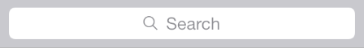

API 注释

想要了解如何在代码中定义搜索栏，请参考 [UISearchBar](https://developer.apple.com/library/ios/documentation/UIKit/Reference/UISearchBar_Class/index.html#//apple_ref/occ/cl/UISearchBar).想要了解更多如何显示搜索栏，请参考 [UISearchDisplayController](https://developer.apple.com/library/ios/documentation/UIKit/Reference/UISearchDisplayController_Class/index.html#//apple_ref/occ/cl/UISearchDisplayController).

搜索栏可能包含以下这些可选元素：

- **占位符文本(Placeholder text)**。占位符文本通常会写明控件的功能（比如上图里的 “Search”字样），或者提示用户输入的文本将在哪里搜索（如“Google”）。
- 书签按钮(The Bookmarks button)。书签按钮可以让用户方便地找到他们需要的内容。例如在地图中搜索时，用户可以通过书签按钮快速选中书签地址、最近搜索记录、或通讯录。

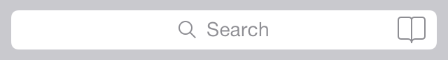

书签按钮只有当搜索栏中没有占位符或用户输入内容时才会出现，当搜索栏中已有文本时，书签按钮会被清除按钮(Clear button)所代替。

- **清除按钮(The Clear button)**。大多数搜索栏都会提供清除按钮，方便用户一键清空输入内容。

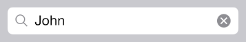

一旦用户在文本框中输入内容，清除按钮就会出现，用户可以用它来一键清空输入内容；而当搜索框中没有任何文本内容时，清空按钮将被隐藏。

- 结果列表图标(The results list icon)。结果图标说明此次搜索有搜出结果。当用户点击它时会出现用户最近一次搜索的搜索结果。

- **提示(Prompt)。描述性标题**，我们称之为提示。描述性标题是一个短而完整的句子，为搜索栏提供介绍或指引应用特定信息。
**在你的应用中使用搜索栏让用户进行搜索。不要使用文本框，**因为文本框的外观不符合用户对搜索的预期。

在 iOS 8 以及之后的版本里，你可以通过 [UISearchDisplayController](https://developer.apple.com/library/ios/documentation/UIKit/Reference/UISearchDisplayController_Class/Reference/Reference.html#//apple_ref/occ/cl/UISearchDisplayController) 简单快捷地把搜索栏放在导航栏中。请注意，当搜索的视图控制器包含在导航控制器里面的时候——比如在邮件应用(Mail)中那样，当用户激活搜索时，搜索栏会自动上浮，平铺到原来导航栏的位置上。
**根据搜索功能在你的应用中的重要程度来选择搜索栏的样式。**如果搜索在你的应用中是最基础的功能，请使用突出样式(the prominent style)；如果搜索不是用户常用的功能，那么可以使用弱化样式(the minimal style)。

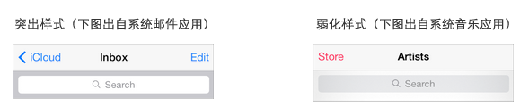

### 4.1.8 范围栏
范围栏只有在与搜索栏一起时才会出现，它让用户可以定义搜索结果的范围。

API 注释

想要了解如何在代码中定义搜索栏与范围栏，请参考 [UISearchBar](https://developer.apple.com/library/ios/documentation/UIKit/Reference/UISearchBar_Class/index.html#//apple_ref/occ/cl/UISearchBar).

当搜索栏出现时，范围栏会出现在它的附近。范围栏的外观与你所指定的搜索栏的外观兼容。

当用户想在明确的分类范围内进行搜索时，使用范围栏是非常有用的。然而，更好的选择是优化您的搜索结果，让用户不需要使用范围栏对搜索结果进行筛选，便可以找到他们所需要的内容。