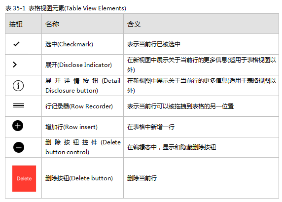

## 4.2 内容视图
### 4.2.1 活动
每个活动表示一个系统提供的或自定义的服务——它可以通过访问活动视图控制器(Activity view controller)来作用于某些特定的内容。

API 注释

想要了解如何在代码中定义活动，请参考 [UI Activity Class Reference](https://developer.apple.com/library/ios/documentation/UIKit/Reference/UIActivity_Class/Reference/Reference.html#//apple_ref/doc/uid/TP40011974).想要了解如何将活动视图控制器整合到你的应用中，请参考 [Activity View Controller](https://developer.apple.com/library/ios/documentation/userexperience/conceptual/mobilehig/ContentViews.html#//apple_ref/doc/uid/TP40006556-CH13-SW121).

动作与分享扩展程序也可以在活动视图控制器中展示。想要了解更多关于这些扩展程序的内容，请参考 [Share and Action Extensions](https://developer.apple.com/library/ios/documentation/UserExperience/Conceptual/MobileHIG/AppExtensions.html#//apple_ref/doc/uid/TP40006556-CH67-SW3).

活动是：

- 一种可定制对象，代表着某个可以让用户在 app 中执行操作的服务
- 以图标的形式呈现，外观与栏按钮图标相似

用户通过点击活动的图标来启动某样活动。点击之后该项服务通常会立刻执行，当这项服务过于复杂时，系统将会进一步索取更多的信息之后才会为用户执行该服务。

使用活动来让用户执行你的应用所提供的服务。请注意，iOS 本身提供了若干内置的服务，如打印，转发到 Twitter，发送信息和 Airplay 等等，你不需要再额外为这些内置任务创建活动。

为你应用的各种服务设计一套精简的线性模板图标(Template image)。后台会将会把这种模板图标作为剪影遮罩，组合成用户最终看到的图标效果。想设计出好看的模版图标，可以遵循以下原则：

- 使用透明度适当的黑色或白色
- 不要使用阴影
- 进行抗锯齿处理
一个活动模版图大小应该保持在70×70像素左右(高分辨率下)，在区域里居中显示。

**为每一个活动设计清晰简练的文字标题。**标题将会出现在活动菜单图标的下方。一般来说短标题效果最好，因为它在屏幕上的显示效果更好并且更容易本地化。如果你的标题文字过长，iOS 会将缩小文本，仍然过长的话则会被截断。一般而言，最好能避免在活动标题中提及你的公司或产品名称。

### 4.2.2 活动视图控制器
活动视图控制器是一个临时视图，当中罗列了一系列可以针对页面特定内容的系统服务和定制服务。

API 注释

想要了解如何在代码中定义活动视图控制器，请参考 [UIActivityView Class Reference](https://developer.apple.com/library/ios/documentation/UIKit/Reference/UIActivityViewController_Class/Reference/Reference.html#//apple_ref/doc/uid/TP40011976).想要了解如何设计一个提供自定义服务的活动菜单，请参阅上文中关于活动彩蛋的内容。

活动视图控制器：

- 显示了让用户可以针对当前内容执行操作的一系列的可配置服务
- 根据所处的场景不同，可能出现在操作列表或浮出层中
使用活动视图控制器来为用户提供一系列针对当前内容的服务。这些服务可以是系统自带的，比如复制，分享到 twitter，打印等等，也可以是自定义的。活动视图控制器通常用作让用户把他们选中的内容复制到他们的社交媒体账户上。

**不要创建一个自定义按钮来触发活动视图控制器。**用户更习惯点击动作按钮后使用系统提供的服务。你应该学会如何更好地利用用户这一既定习惯，而不是强迫他们以一种全新的方式来完成同样的事情。

**确保控制器中的操作适用于当前场景。**你可以适当地在活动视图控制器中增减系统操作，或增加自定义操作。例如，如果你不希望用户打印某张图片，你可以把打印功能从控制器中删除。

注意

你不能改变系统默认服务在控制器中的顺序。同时，所有系统服务都应该出现在自定义服务之前。

### 4.2.3 集合视图
集合视图用于管理一系列有序的项，并以一种自定义的布局来呈现它们。

API 注释

想要了解如何在代码中定义集合视图，请参考 [Collection View Programming Guide for iOS](https://developer.apple.com/library/ios/documentation/WindowsViews/Conceptual/CollectionViewPGforIOS/Introduction/Introduction.html#//apple_ref/doc/uid/TP40012334).

集合视图：

- 可包含装饰视图，以从视觉上区分项的子集或者提供装饰性项目，例如自定义背景。
- 布局切换时支持自定义转场动画。（默认情况下，当用户导入、移动或者删除项的时候，会出现系统默认的动画效果。）
- 支持开发者额外定义手势识别来执行自定义操作。默认情况下，集合视图可以识别轻击(tap)某项以选中，和长按(touch-and-hold)某项进行编辑。
使用集合视图来让用户查看和操作一系列不适合以列表形式呈现的项。由于集合视图的布局不是一个严格的线性布局，因此尤其适合用来展示一些尺寸不一致的项。

集合视图支持广泛的自定义，因此我们要尽量避免把心思都放在进行全新的设计上。集合视图是用来帮助用户更好地完成任务的，视图本身并不是用户体验的焦点所在。以下指南可以帮助你设计出用户体验更好的集合视图：

**表格视图(table view)更适用的时候，不要使用集合视图。**有时候用户会觉得以列表呈现的信息更容易阅读和理解，例如将文本信息放在滚动列表中的时候，用户阅读和处理起来会更为简单和高效。

**让视图中的项更容易选中。**如果用户很难点中集合视图中的项，他们是不会愿意用你的应用的。跟所有用户可以点击的UI对象一样，请确保你的集合视图中每一个项的最小点击区域有44×44pt，尤其是在 iPhone 上。

**当你要让整个布局进行动态变化时，请务必谨慎。**集合视图允许你在用户浏览和操作项的时候调整视图的布局。但当你决定调整它的时候，请确保这个动态变化是有意义且容易跟踪的。没有明确目的而贸然改变集合视图的布局会让用户对应用留下难用、不符合预期等负面的印象。更有甚者，如果用户此时关注的项在变化中消失了，用户会觉得这个应用超出了他们的控制能力。

### 4.2.4 容器视图控制器
容器视图控制器采用自定义的方式来管理和呈现它的视图控制器或一系列子视图。系统定义的容器视图控制器典型例子包括标签栏视图控制器(Tab bar view controller)、导航视图控制器(navigation view controller)和对分视图控制器(split view controller)。

API 注释

想要了解如何在代码中定义容器视图控制器，请参考 [UIViewController Class Reference](https://developer.apple.com/library/ios/documentation/UIKit/Reference/UIViewController_Class/Reference/Reference.html#//apple_ref/doc/uid/TP40006926).

容器视图控制器不存在任何预先定义好的外观或者行为。

用容器视图控制器来呈现内容，使用户可以通过控制器来以自定义的方式进行导航。

**先问问你自己是不是必须用到容器视图控制器。**用户会更习惯诸如对分视图、或者是标签栏视图这类他们所熟知的东西。你必须确保你设计的控制器的优点不会由于用户不熟悉、不认识、不会用而白费功夫。

**确保你的容器内容控制器在横屏与竖屏模式都可用。**很重要的一点是，你的容器视图控制器无论在横屏还是竖屏中，体验都应该是一致的。

**一般来说，避免太过花哨的转场动画。**如果你采用了故事板(storyboard)的设计方法来设计你的视图控制器，你往往自然而然地会为它自定义一些动画。但绝大多数情况下，这些花哨的转场动画会让用户分心，让他们忘记了当前要做的事，还可能降低你的应用整体的美感。

### 4.2.5 图片视图
图片视图用以展示一张单独的图片，或者一系列动态图片。

API 注释

想要了解如何在代码中定义图片视图，请参考 [UIImageView](https://developer.apple.com/library/ios/documentation/UIKit/Reference/UIImageView_Class/index.html#//apple_ref/occ/cl/UIImageView).

图片视图：

- 不存在任何预先定义好的外观，同时在默认状态下它不支持用户的交互行为。
- 可以检测图片本身及其父视图(parent view)的属性，并决定这个图片是否应该被拉伸、缩放、调整到适合屏幕的大小，或者固定在一个特定的位置。
在iOS 7及以上版本里，包含了模版图片(template image)的图片视图会把当前的色调(tint color)应用到图片上。

请务必确保图片视图中的每一张图片都保持相同的尺寸和比例。如果你的图片尺寸各不相同，图片视图将会逐一对它们进行调整；而当你的图片比例不一，渲染的时候很可能会出错。

### 4.2.6 地图视图
地图视图呈现地理数据，同时支持系统内置地图应用的大部分功能（如下图所示）。

API 注释

想要了解如何在代码中定义图片视图，请参考 [MapKit Framework Reference](https://developer.apple.com/library/ios/documentation/MapKit/Reference/MapKit_Framework_Reference/index.html#//apple_ref/doc/uid/TP40008210).

地图视图：

- 通常以标准地图、卫星图像、或两者结合的形式来展示地理区域
- 可以展示以单点标注的备注，以及叠加图层（绘制路径或二维区域绘制轮廓的）
- 支持编程时定义的，或用户所控制的缩放和移动
利用地图视图可以给用户提供一个可交互的地理区域视图。如果你在开发一个导航类应用(routing app)，可以使用地图视图来展示你给用户的路径。

**一般来说，允许用户在视图中进行交互行为。**用户习惯了在系统内置地图中进行交互，因此他们会有预期，能在你所提供的地图中进行类似的行为。

**使用标准的地图标注颜色。**地图上标注了一系列地点。因为用户习惯了内置地图的各个标注的颜色，所以最好避免在你的应用中重新定义这些颜色的含义。定义颜色时，请遵循以下这些标准：

- 红色表示目的地
- 绿色表示起点
- 紫色表示用户指定的地点(User-Specified Point)
### 4.2.7 页面视图控制器
页面视图控制器通过滚动(Scrolling)或翻页 (Page-curl transition style)两种方式来处理长度超过一页的内容。下图是 iOS 模拟器中的翻页样式：

API 注释

想要了解如何在代码中定义图片视图，请参考 [Page View Controllers](https://developer.apple.com/library/ios/documentation/WindowsViews/Conceptual/ViewControllerCatalog/Chapters/PageViewControllers.html#//apple_ref/doc/uid/TP40011313-CH4).

页面视图控制器：

- 带滚动条的页面视图控制器没有默认的外观。
带翻页效果的控制器可以在两页中间增加书脊(book spine)的效果

- 可以根据指定的转场来模拟出页面切换时的动画。
使用滚动条效果的时候，当前页面将滚动到下一页；而使用翻页效果时，页面上会出现一个模拟实体书或笔记本翻页效果的翻页动画

使用页面视图控制器来展示那些线性的内容（比如一个故事的文本），或者是一些可以被自然地拆分成块的内容（比如日历）。

**如果需要的话，设计一种自定义的方式让用户可以以非线性的方式来获取内容。**页面视图控制器让用户从一页移动到前一页或者后一页，而并不支持用户在并不相邻的页面间快速切换。如果你希望在页面视图控制器中展示一些非线性的内容——比如说字典，或者书籍的目录——那么你就需要自定义一种方式，让用户可以随意地到达不同的内容区块。

### 4.2.8 浮出层
浮出层是当用户轻点某个控件或页面中的某一区域时浮出的，半透明的临时视图。

API 注释

在 iOS 8 以及以上版本里，你可以使用 [UIPopoverPresentationController](https://developer.apple.com/library/ios/documentation/UIKit/Reference/UIPopoverPresentationController_class/index.html#//apple_ref/occ/cl/UIPopoverPresentationController) 来展示一个浮出层。UIPopoverPresentationController 定义了一种委托，让你可以调整浮出层的内容样式，让它能够更好地适应当前的屏幕内容。举个例子，在横屏视图中，你的内容可能会全部承载在浮出层内部；而在竖屏的情况下，浮出层可以以一种全屏模态视图的样式出现。

浮出层：

- 是一个自包含的模态视图
- 在横屏环境中，浮出层会包含一个箭头，指向其出处
- 背景是半透明的，并且会模糊其背后的内容（毛玻璃效果）
- 可以包含多种对象和视图，比如：
- 表格，图片，地图，文本，网页或者自定义视图
- 导航栏，工具栏，和标签栏
- 可以操作当前 app 视图中的对象的各种控件或对象
（默认情况下， 浮出层中的表格视图，导航栏和工具栏的背景都是透明的，这样会让浮出层的毛玻璃效果展示出来）

在横屏的情况下，动作列表总是出现在浮出层里。

使用浮出层来展示与当前焦点或被选中对象相关的额外信息，或者相关的一系列项。

重要

这一个部分的指引仅适用于在横屏情况下的 UI 与用户体验。如果你想在竖屏环境中展示全屏的浮出层，请参阅下文中的模态视图相关内容。

避免提供“取消浮出层”按钮。浮出层应当在它不需要的时候自动关闭。如果要决定什么时候不再需要浮出层，请考虑如下场景：

**一般来说，在用户点击浮出层以外的区域的时候，保存用户输入的内容。**不是每一个浮出层都会让用户明确地确认取消操作，因此用户可能会误操作。只有当用户点击“取消”按钮时，才清空他们在浮出层中输入的内容。

**让浮出层中的箭头尽可能直接地指向其出处。**这样有助于用户这个浮出层是从哪里来的，以及他们与哪些任务和对象相关。

**确保用户在看不到浮出层背后的内容的时候仍然能顺利使用浮出层。**浮出层会模糊背后的内容而且用户不能把它拖拽到其它位置。

确保同一时间内屏幕上只有一个浮出层。你不应该同时展示超过一个浮出层（或者外观和行为跟浮出层很相似的模态视图）。尤其应当避免同时展示一连串或者一系列浮出层，从一个浮出层中弹出另一个浮出层。

**不要在浮出层上面再展示一个模态视图。**除了告警框(alert)外，浮出层中不应当有任何模态视图。

**可能的话，让用户可以仅点击一下就关闭当前浮出层并开启一个新的浮出层。**这在若干栏按钮每个都会唤起一个浮出层的时候尤其好用，因为它减少了用户的额外点击。

不要把浮出层设计得太大。浮出层不应当占据整个屏幕。相反，它的大小应当恰好能承载当中的内容，又能清楚地指向浮出层的唤起出处。浮出层的高度是不固定的，因此你可以用它来承载一个很长的项目列表。但一般来说，还是应当避免需要滚动浮出层才能开启一个任务。请注意，系统可能会调整浮出层的宽高，以让它能够更好地适应屏幕的尺寸。

**在浮出层中使用标准的 UI 控件和视图。**一般来说，包含标准控件和视图的浮出层看上去最理想，而且更容易让用户理解。

**确保自定义浮出层仍然长得像一个浮出层。**尽管使用 [UIPopoverBackgroundView](https://developer.apple.com/library/ios/documentation/UIKit/Reference/UIPopoverBackgroundView_class/index.html#//apple_ref/occ/cl/UIPopoverBackgroundView) API 能够很容易自定义浮出层的多种外观属性，还是应当避免设计出一个用户可能无法辨识的浮出层外观。如果你对浮出层的改动过大，用户就不能凭借之前的经验来理解如何用你的 app 里的浮出层了。

**当浮出层可见的时候，想要改变它的尺寸的话请务必谨慎。**当你要在浮出层里展示同样信息的精简或拓展视图时，你可能需要改变浮出层的大小。当你一定要这么做的时候，使用转场动画往往是个好主意，因为这不会让人觉得一个新的弹出窗口取代了原来的窗口。

### 4.2.9 滚动视图(Scroll View)
滚动视图方便用户浏览尺寸超越滚动视图边界的图片（下图中地球的图片无论是长度还是宽度都超过了）。

API 注释

想要了解如何在代码里定义滚动视图，请参考 [UIScrollView](https://developer.apple.com/library/ios/documentation/UIKit/Reference/UIScrollView_Class/index.html#//apple_ref/occ/cl/UIScrollView).

滚动视图：

- 没有预定义的外观
- 在刚出现或者当用户对它进行操作的时候会短暂地闪烁
- 响应速度和对各个操作手势的识别都应当让用户感到自然。当用户在视图中拖拽内容，内容随之滚动；当用户轻扫屏幕时，内容将快速滚动——直到用户再次触摸屏幕或内容已经到达底部时停止。
- 可以应用在页模式(paging mode)中，在此模式下用户可以通过拖拽和轻击等手势来浏览一页的内容
使用滚动视图来允许用户在固定的空间内浏览大尺寸或大量的视图。

**适当地支持缩放操作。**如果放大和缩小对于当前内容是有用的话，你可以支持用户通过捏或者双击来对当前视图进行缩放。而若是支持了缩放操作的话，你还应当根据用户当前的任务来设定在当前情景下允许缩放的最大值和最小值。如果你允许一个字符被放大到充满整个屏幕的话，用户会很难阅读当前内容。

**在页模式滚动视图中，可以考虑使用页面控件(page control)。**当你想要展示分页、分屏或者分块的内容，可以使用页面控件来让用户知道当前内容一共有多少块，以及他们当前浏览的是第几个。

当你在滚动视图中使用页面控件的时候，最好禁用同一方向的滚动指示器(scroll indicator)。这样一来可以让用户聚焦到页码控件上，并让他们有了一种唯一且清晰的方式来浏览当前内容。想要了解更多，请参考下文控件中的页面控件部分内容。

**一般来说，一次只展示一个滚动视图。**由于用户滚动屏幕时动作幅度经常都会很大，如果在一屏中同时存在不止一个滚动视图，他们很容易会碰到另一个。如果你确实要在同屏中放两个滚动视图，可以考虑给他们设定不同的滚动方向，来避免用户想要滚动一个视图的时候误操作。比如 iPhone 上的股票应用，纵向滚动上半部分会展示股票报价，横向滚动下半部分时则展示该公司的特定信息。

### 4.2.10 分栏视图控制器
分栏视图控制器是一个用于管理两个相邻视图控制器显示的全屏视图控制器。

API 注释

每一个对分视图控制器的子视图负责管理一个窗格的展现。对分视图控制器本身负责展示这些子视图控制器与管理不同屏幕方向下对分视图的转场效果。想要了解更多如何在代码里定义对分视图，请参考 [UISplitViewController Class Reference](https://developer.apple.com/library/ios/documentation/UIKit/Reference/UISplitViewController_class/index.html#//apple_ref/doc/uid/TP40009277) 和 [SplitControllers](https://developer.apple.com/library/ios/documentation/WindowsViews/Conceptual/ViewControllerCatalog/Chapters/SplitViewControllers.html#//apple_ref/doc/uid/TP40011313-CH7).

在 iOS 7 及之前的版本里，对分视图控制器仅适用于 iPad.

默认情况下，对分视图控制器通过当前的尺寸来管理其子视图。举个例子，对分视图：

- 可以在横屏环境中展示并排展示两个窗格
- 可以让主窗格在详情窗格上方显示，也可以在不需要的时候（尤其是竖屏情况下）隐藏主窗格。
你可以指定特殊的展示环境下对分视图的版式，并且通过请求对分视图控制器聚焦于这个版式，以此改变窗格的排列方式。

对分视图控制器包含广泛的对象和视图，诸如：

- 表格，图像，地图，文本，网络，或自定义视图
- 导航栏，工具栏，或标签栏
注意

即使左侧窗格通常被称为主窗格，右侧窗格被称为详情窗格，但在代码中并没有强制固定这种从属关系。

使用对分视图控制器，在左侧主窗格展示固定的信息，在右侧详情窗格展示相关的详情或从属信息。以这种设计模式，当用户选择类主视图中的某一项，右侧详情窗格应当展示相应与这一项相关的内容。（你应当在代码中实现这个效果。）

**避免创建一个比主窗格更窄的详情窗格。**如果右侧详情窗格比左侧主窗格窄，对分视图控制器将不能占满整个屏幕，产生视觉不平衡的整体效果。

**避免在两侧窗格中都同时展示导航栏。**这样会让用户很难分清这两个窗格的从属关系。

**一般来说，始终显示左侧主窗格中当前选中的项。**尽管右侧窗格中的内容会变化，但它应当始终保持着与当前选中窗格的相关性。这样的体验有助于用户理解左侧窗格项与右侧窗格内容的关系。

**合适的话，给用户提供不止一种获取主窗格的方式。**默认情况下，竖屏方向时只会展示右侧窗格，因此你需要向用户提供一个按钮（通常位于导航栏上）来让用户唤起和隐藏主窗格。对分视图控制器也支持轻扫手势来执行呼出和隐藏的动作。除非你的 app 有定义轻扫的手势执行其他功能，否则你应当支持用户轻扫以唤起左侧窗格。

### 4.2.11 表格视图
表格视图以一个可滚动的单列多行的形式来展示数据。

API 注释

想要了解如何在代码中定义表格视图，请参考 [Tabel View Programming Guide for the iOS](https://developer.apple.com/library/ios/documentation/userexperience/conceptual/TableView_iPhone/TableViewStyles/TableViewCharacteristics.html#//apple_ref/doc/uid/TP40007451) 以及 [UITableView](https://developer.apple.com/library/ios/documentation/UIKit/Reference/UITableView_Class/index.html#//apple_ref/occ/cl/UITableView).

表格视图：

- 以容易进行分段或分组的单列形式展示数据
- 用户可以通过点击来选中某行，或通过控件来添加、移除、多选、查看详情或者展开另一个表格视图
iOS 定义了两种表格样式：

**分组型（Grouped）。**表格行以分组形式展示，可以有页眉和页脚。分组表格视图中至少含有一组列表，而每一组中至少包含一项内容。与平铺型不同，分组型表格没有索引。

**平铺型（Plain）。**平铺型表格可被分为若干带标签的段落，表格右侧可能会出现垂直的表格索引。每行开头可以有页眉，尾部可以有页脚（也可以没有）。

在这两种样式中，当用户选中某一行时，该行会短暂地高亮。当选中某行将展开另外一屏内容的时候，该行会短暂地高亮，然后新一屏内容滑入。当用户回到前一屏时，之前选中的那一行同样会短暂地高亮，提醒用户他们先前选中了什么（但并不会一直保持高亮）。
除了以上表格中列举的元素外，iOS 定义了刷新控件，让用户可以刷新当前的表格内容。想要了解更多关于刷新控件的用法，可以参考文档本章第三节控件中的刷新控件。iOS 提供了若干表格视图元素(table-view elements)来扩展表格视图的功能。除了特别标明外，这些元素只适用于表格视图。

iOS 定义了在平铺型表格和分组型表格中最常用到的四种单元格布局样式。每种单元格样式都有最适合展示的信息类型。

重要

从编程角度来说，这些样式应用于单元格中，用以控制表格里每一列的绘制方式。

**默认型（Default）**([UITableViewCellStyleDefault](https://developer.apple.com/library/ios/documentation/UIKit/Reference/UITableViewCell_Class/Reference/Reference.html#//apple_ref/c/econst/UITableViewCellStyleDefault))。默认型样式包括左侧的图标（可选），和图标右边左对齐的文字标题。

默认型样式适合展示一系列无须通过附加信息便可以区分的项。

**副标题型（Subtitled）**([UITableViewCellStyleSubtitle](https://developer.apple.com/library/ios/documentation/UIKit/Reference/UITableViewCell_Class/Reference/Reference.html#//apple_ref/c/econst/UITableViewCellStyleSubtitle))。副标题型包括左侧图标（可选），图标右边左对齐展示的文字标题，以及在标题下方同样左对齐展示的副标题。

左对齐的文本标签让用户可以更快速地扫视表格。这种样式适用于列表各项较为相似的情况，用户可以通过副标题中的详细信息来区分列表中的各项。 ([UITableViewCellStyleSubtitle](https://developer.apple.com/library/ios/documentation/UIKit/Reference/UITableViewCell_Class/Reference/Reference.html#//apple_ref/c/econst/UITableViewCellStyleSubtitle))。副标题型包括左侧图标（可选），图标右边左对齐展示的文字标题，以及在标题下方同样左对齐展示的副标题。

**Value 1** ([UITableViewCellStyleValue1](https://developer.apple.com/library/ios/documentation/UIKit/Reference/UITableViewCell_Class/Reference/Reference.html#//apple_ref/c/econst/UITableViewCellStyleValue1)).在 Value 1 样式下，标题左对齐，副标题用较细的字体右对齐。

**Value 2** ([UITableViewCellStyleValue2](https://developer.apple.com/library/ios/documentation/UIKit/Reference/UITableViewCell_Class/Reference/Reference.html#//apple_ref/c/econst/UITableViewCellStyleValue2)).Value 2 样式蓝色字体标题右对齐，黑色字体的副标题左对齐，混排在同一行中。这种样式通常不包含图片。

Value 2 的布局中，文本和副标题中间的垂直间距会让用户专注于副标题的第一个单词。

重要
以上四种单元格样式均支持添加表格视图元素，如勾选或展开标志。添加这些元素会缩小标题以及副标题单元格的可用宽度。

使用表格视图可以简洁而高效地展示少量或者大量信息。举例来说，你可以通过表格视图来：

- **展示用户可选的选项列表。**你可以使用选中标记来告知用户当前选中了哪些项。
无论是平铺型还是分组性，用户点击某一行中的某一项时都可以显示一个选项列表。当用户点选了一个不属于表格行的按钮或者其他 UI 元素的时候，可以使用平铺型表格视图来展示唤起的选项列表。

- **展示层级信息。**平铺型表格样式非常适合展示层级信息。表格中的每项都指向承载于另一个列表中的不同子信息。用户可以沿着这些层级结构的路径来点击每一层列表中的项。以展开标志告知用户点击这一列中的任何位置，都将展开新的列表以展示其子类信息。
- **展示可以在概念上进行分组的信息。**平铺型和分组型列表都允许你通过提供页眉和页脚来对信息进行分组和分段。
你可以用页眉页脚视图(header-footer view)——即 UITableViewHearderFooterView 中的一个实例——来展示页眉和页脚的文字，或图片。想要了解如何在代码中定义页眉页脚视图，请参考 [UITableViewHeaderFooterView Class Reference](https://developer.apple.com/library/ios/documentation/UIKit/Reference/UITableViewHeaderFooterView_class/Reference/Reference.html#//apple_ref/doc/uid/TP40012241).

**使用表格视图时，可遵循以下这些指引：**

**用户选择列表项时，始终给与反馈。**当用户点击可选的列表项时会认为被点击的项都应短暂地高亮一下。在点击后，用户期望出现新的视图，或者出现一个复选标记以表明先前点击的项已经被选中或激活。

**如果表格的内容庞大而且复杂，不要在所有数据都加载完之后才一起显示出来。**可以首先展示文本信息，图片等较为复杂的内容则在加载完后再显示。这样可以将有用的信息立即传达给用户，同时也提高了应用的响应能力。

**在等待信息加载的时候，可以考虑展示“过期”信息。**尽管我们并不推荐在数据频繁变化的应用中这样做，它还是可以帮助更多的静态应用程序立即给到用户有用的信息。当然在你这么做之前，请认真衡量你应用中数据的变化频率，并弄清楚你的目标用户有多需要立即获取最新的信息。

**如果信息加载速度很慢或者非常复杂，你需要告诉用户加载正在进行中。**如果表格中所有内容都很复杂，我们很难即时地给用户展示任何内容。在这种极端情况下，切勿显示空白的表格，因为这会让用户以为应用挂了。此时应当在屏幕中央展示一个活动指示器(activity indicator)和一个信息标签(information label)，比如“加载中…”，让用户知道加载仍然在进行。

**如果合适的话，为删除按钮自定义一个名称。**如果这能让用户更好地理解应用的相关功能的话，你可以创建一个合适的标题，来取代“删除”这个字样。

**尽量使用简洁的文字标签，以避免被截断。**繁冗的文字和词组不方便用户浏览和理解。以上所有单元格样式均会自动截断文本，而文本截断所造成的问题可大可小，取决于你采用的单元格样式，以及被截断了哪一部分文字。

**如果你想以一种非标准的形式来布局你的表格，**最好是自定义一种单元格样式，而不是在现有的表格样式上进行改动。如何创建自定义单元格样式，请参考 [Table View Programming Guide for iOS](https://developer.apple.com/library/ios/documentation/UserExperience/Conceptual/TableView_iPhone/AboutTableViewsiPhone/AboutTableViewsiPhone.html#//apple_ref/doc/uid/TP40007451) 中的 [Customizing Cells](https://developer.apple.com/library/ios/documentation/UserExperience/Conceptual/TableView_iPhone/TableViewCells/TableViewCells.html#//apple_ref/doc/uid/TP40007451-CH7-SW18) 部分。

### 4.2.12 文本视图
文本视图可以接收和展示多行文本。

API 注释

想了解如何在代码中定义文本视图，参考 [Text Views](https://developer.apple.com/library/ios/documentation/UserExperience/Conceptual/UIKitUICatalog/UITextView.html#//apple_ref/doc/uid/TP40012857-UITextView).

文本视图：

- 是一个可定义为任何高度的矩形
- 当内容太多超出视图的边框时，文本视图支持滚动
- 支持自定义字体、颜色和对齐方式（默认情况下，文本视图会以左对齐的黑色系统字体显示）
- 可以支持用户编辑，当用户轻击文本视图内部时，将唤起键盘（键盘的布局和类型取决于用户的系统语言设置）
**始终确保文字的易读性。**虽然你可以使用属性字符串将不同的字体、字色和对齐方式串联在同一个文本视图内，但保持文本的可读性是必不可少的。最好是可以支持动态文本(Dynamic Type)和 UIFont method preferredFontForTextStyle 来展示文本框中的文本。想要了解更多动态文本的指引，可以参阅本文第一章中颜色与字体里的部分；想要了解更多编程相关的内容，可以参阅 [Text Styles](https://developer.apple.com/library/ios/documentation/StringsTextFonts/Conceptual/TextAndWebiPhoneOS/CustomTextProcessing/CustomTextProcessing.html#//apple_ref/doc/uid/TP40009542-CH4-SW65).

**根据输入内容的类型来指定不同的键盘类型。**举例来说，你希望用户能更方便地输入网址、密码或者电话号码。但请注意，由于键盘的布局以及输入方法是由用户的系统语言设置决定的，这是你不能控制的。

iOS 提供了各种不同的键盘类型，以便用户输入不同类型的文本。想要了解可用键盘类型，可以参考 [UIKeyboardType](https://developer.apple.com/library/ios/documentation/UIKit/Reference/UITextInputTraits_Protocol/Reference/UITextInputTraits.html#//apple_ref/c/tdef/UIKeyboardType).想要了解如何在管理你的应用中的键盘，请参考 [Managing the Keyboard](https://developer.apple.com/library/ios/documentation/StringsTextFonts/Conceptual/TextAndWebiPhoneOS/KeyboardManagement/KeyboardManagement.html#//apple_ref/doc/uid/TP40009542-CH5).

4.2.13 网络视图
网络视图是一个可以展示丰富的 HTML 内容的区域。（下图是 iPhone 自带的邮件应用，网络视图指的是下图中导航栏和标签栏中间的区域）

API 注释

想要了解如何在代码中定义网络视图，请参考 [Web Views](https://developer.apple.com/library/ios/documentation/userexperience/conceptual/UIKitUICatalog/UIWebView.html#//apple_ref/doc/uid/TP40012857-UIWebView).

网络视图：

- 展示网络内容
- 会自动处理页面中的内容，比如把页面中的电话号码转化成电话链接（译者按：phone link，点击之后 iPhone 将自动拨打该号码）。
如果你有一个网页或者网络应用，你大约会用网络视图来实现一个简单的 iOS App，来对你的网页或者应用进行一个封装。如果你打算用网络视图来访问你所控制的网页内容，请务必阅读 [Safari Web Content Guide](https://developer.apple.com/library/ios/documentation/AppleApplications/Reference/SafariWebContent/Introduction/Introduction.html#//apple_ref/doc/uid/TP40002051).

**不要用网络视图来创建一个看起来像迷你网络浏览器的应用。**用户期望使用 iOS 自带的 Safari 来浏览网页内容，因此我们并不推荐你在自己的 app 里复制这种以被广泛应用的功能。