## 4.4临时视图
### 4.4.1 警告框
警告框用于告知用户一些会影响到他们使用 app 或设备的重要信息。

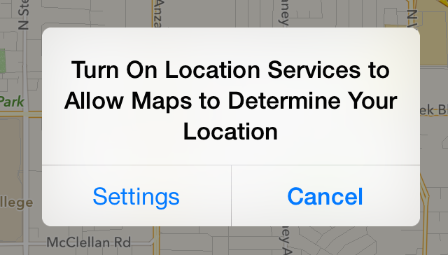

API 提示：

如需在代码中使用警告框，你可以创建 [UIAlertController](https://developer.apple.com/library/ios/documentation/UIKit/Reference/UIAlertController_class/index.html#//apple_ref/occ/cl/UIAlertController) 并且指定 [UIAlertControllerStyleAlert](https://developer.apple.com/library/ios/documentation/UIKit/Reference/UIAlertController_class/index.html#//apple_ref/c/econst/UIAlertControllerStyleAlert).

警告框：

- 必须包含标题，有时候会包含正文文本
- 包含一个或多个按钮
一般来说，警告框警告出现的频率较低，也正因为如此，警告的出现通常会让用户额外重视。请严格控制你的 app 中警告的个数，并且保证每一个警告都能提供重要的信息，或者有用的选项。

**避免出现不必要的警告框。**一般来说，在以下情景中，是不需要用到警告框的：

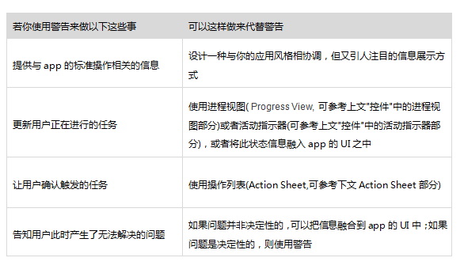

当你在设计警告文案的时候，了解以下这些定义非常有用：

- **标题式大写(Title-style capitalization)**指的是除了冠词，并列连词以及少于4个字母且不处在第一个单词位置上的介词外，标题中每个单词的首字母均大写。
- **句子式大写(Sentence-style capitalization)**指的是第一个字母大写，其余除了专有名词和专有形容词外的字母均小写
**简明扼要地描述当前情景，并告诉用户他们可以做什么。**理想情况下，警告框中的文字应该给与用户足够的情景和上下文联想，让他们可以清楚地知道为什么警告会出现，同时帮助他们判断自己应该点哪个按钮。

**保证标题足够简短，最好在一行之内。**过长的标题让用户很难快速理解它的意思，还可能会被截断。

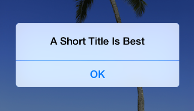

**避免单个字的标题。**单字标题，例如：错误，或警告，几乎不能提供任何有用信息。

**如果可以的话，使用句子片段而非完整的句子。**一个简洁清晰的状态描述往往比一个完整的句子更容易理解。

**尽可能的精炼你的标题文字，让警告框即使没有下面的正文信息也能完全让用户理解。**举个例子，当你使用一个问题，或者两个短句来作为警告框标题的话，很可能你并不需要添加文本信息。

**不用刻意避免在警告框中使用消极负面的文案。**用户们理解大多数警告框是为了告诉他们发生的问题，或者对他们目前的状态作出警告。因此消极但清晰直接的文案优于积极但晦涩间接的文案。

**尽可能地避免使用“你”，“你的”，“我”，“我的”这类字眼。**有时候，这些直接指向的字眼容易引起歧义，有时候甚至会被误认为是一种冒犯。
适当地使用大写和标点符号，尤其是在以下这些场景中：

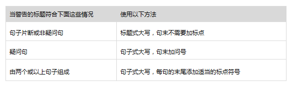

**如果你必须为警告框添加正文文本，请使用一个完整的短句。**可能的话，尽量保证句子在1到2行之间。如果句子太长，用户会需要滚动才能看完，这样的体验很糟。使用句子式大写，并在句末加上适当的标点符号。

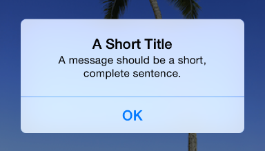

**避免在文本中详细描述“该按哪个按钮”而导致文本过长。**理想情况下，表意明确的警告文案和逻辑清晰的按钮文案已经足以让用户正确判断自己该按哪个按钮了。但如果你一定要在文案中描述这些内容，请遵循以下原则：

- 确定使用轻击(tap)来描述这个选择操作，不要用触摸(touch)、点击(click)或者选择(choose)这类字眼。
- 不要用引号，但保证大写
**确保警告框在竖屏和横屏中均显示正常。**横屏模式下警告框的高度会受到限制，其大小与竖屏下可能会有区别。我们推荐您限定好警告框的最大高度，保证在竖屏和横屏模式下文字均能不需要滚动便可完整地显示。

**一般情况下，使用两个按钮的警告框。**两个按钮的警告框是最为常见和有用的，因为它最便于用户在两个按钮中做选择。单按钮警告框不那么有用，因为它通常只是起到告知的作用，并未给予用户控制当前状态的能力。多于两个按钮的警告框太过复杂，应该尽可能地避免使用。如果你在警告框中设计了太多按钮，它也许会导致警告框被强制滚动，这也是一个非常糟糕的体验。

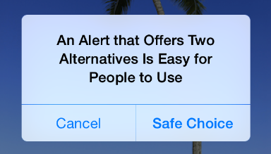

提示

如果你需要在警告框中给与用户超过2个选项，可以考虑使用操作列表来代替警告框。

**正确地放置按钮。**理想情况下，最容易点击也最不容易点错的按钮符合两个条件：它代表了用户最可能会选择的操作，即使用户一时不注意误点了它，也不会造成严重问题。尤其是：

- 如果这个按钮不会造成损害性结果，又是用户最有可能会选择的操作，那么它应该放在右边，取消按钮则应该放在左边。
- 如果这个按钮会造成损害性后果，又是用户最有可能会选择的操作，那么它应该被放在左边，取消按钮应该放在右边。
提示

一般来说，当警告框出现的时候，按 Home 键将会从该 app 里切回主屏幕，此时 Home 键的效果类似于取消按钮——当用户回到 app 中的时候，警告框将消失，操作也不会被执行。

**为按钮设计简短而逻辑清晰的文案。**好的按钮文案一般只有1到2个单词，描述用户点击按钮后的结果。设计文案时可以遵循以下指南：

- 跟其它所有按钮一样，使用标题式大写，而且不需要标点符号
- 尽可能的使用与警告文案直接相关的动词或动词词组，如”取消(Cancel)”，”查看全部(View All)”，”回复(Reply)”和“忽略(Ignore)”等
- 当没有更好的选择的时候，可以使用”OK”.避免使用”是(Yes)”或”否(No)”。
- 避免使用”你”，“你的”，“我”，“我的”这类字眼。含有这些字眼的文案可能会指代不清，还有可能造成冒犯。
### 4.4.2 操作列表
操作列表展示了与用户触发的操作直接相关的一系列选项。

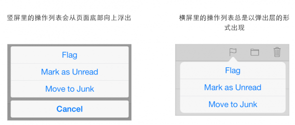

API 提示：

如需在代码中使用操作列表，你可以创建一个 [UIAlertController](https://developer.apple.com/library/ios/documentation/UIKit/Reference/UIAlertController_class/index.html#//apple_ref/occ/cl/UIAlertController).并指定 [UIAlertControllerStyleActionSheet](https://developer.apple.com/library/ios/documentation/UIKit/Reference/UIAlertController_class/index.html#//apple_ref/c/econst/UIAlertControllerStyleActionSheet)

操作列表：

- 由用户某个操作行为触发
- 包含两个或以上的按钮
使用操作列表来：

**提供完成一项任务的不同方法。**操作列表提供一系列在当前情景下可以完成当前任务的操作，而这样的形式不会永久占用页面 UI 的空间。

**在用户完成一项可能有风险的操作前获得用户的确认。**操作列表让用户有机会停下来充分考虑当前操作可能导致的危险结果，并为他们提供了一些其它的选项，尤其是在以下这些情景下：

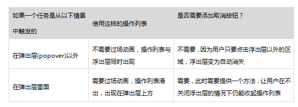

**使用红色文字来表示可能存在破坏性的操作。**在操作列表的顶部使用文字颜色为红色的按钮，因为越靠近列表顶部的操作越容易引起用户注意。在 iPhone 里，潜在风险的操作离列表底部越远，用户在关注 Home 键的时候就越不容易误点它。

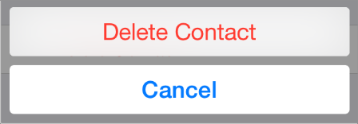

**避免让用户滚动操作列表。**如果你的操作列表中存在过多按钮，用户必须要滚动才能看完所有操作。这样的体验是可能让用户不安，因为他们要花更多的时间来充分理解每个选项的区别。此外，用户在滚动的过程中将很有可能误点其它按钮。

### 4.4.3模态视图
模态视图是一个以模态形式展现的视图，它为当前任务或当前工作流程提供独立的、自包含的(self-contained)功能。

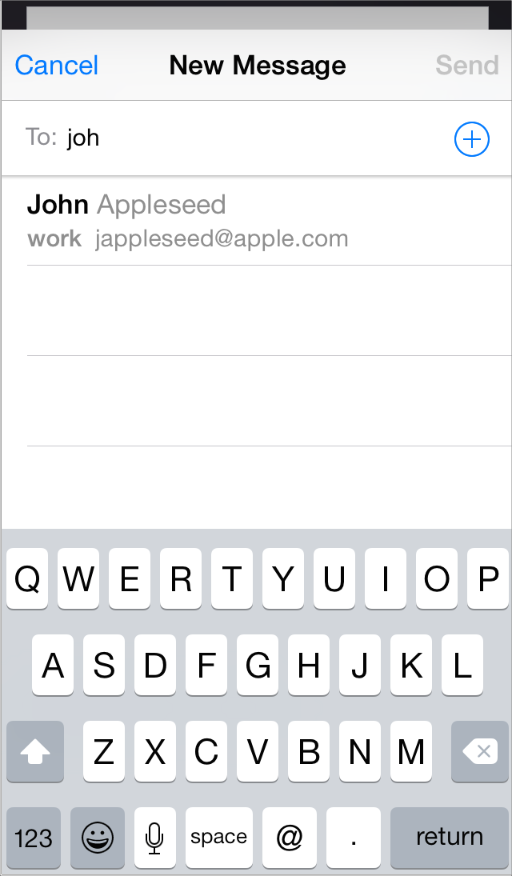

API 提示：

如需在代码中使用模态视图，你可以创建一个 [UIPresentationController](https://developer.apple.com/library/ios/documentation/UIKit/Reference/UIViewController_Class/index.html#//apple_ref/c/tdef/UIModalPresentationStylehttps://developer.apple.com/library/ios/documentation/UIKit/Reference/UIPresentationController_class/index.html). 并指定适当的样式(完整的样式列表，请参考 [Modal Presentation Styles](https://developer.apple.com/library/ios/documentation/UIKit/Reference/UIViewController_Class/index.html#//apple_ref/c/tdef/UIModalPresentationStylehttps://developer.apple.com/library/ios/documentation/UIKit/Reference/UIPresentationController_class/index.html))

模态视图：

- 能占据整个屏幕，它也可能占据整个父视图(parent view)的区域，或者是屏幕的一部分
- 包含完成当前任务所需的文字和控件
- 通常也会包含一个完成任务的按钮（点击后即可完成任务，当前模态视图也会消失），和一个取消按钮（点击后即放弃当前任务，同时当前模态视图消失）
当需要用户完成与你的 app 中的基础功能相关的、独立的任务的时候，可以使用模态视图。模态视图尤其适用于那些所需元素并非常驻在 app 主要 UI 中、又包含多个步骤的子任务。

**根据当前任务的种类和你的 app 的整体视觉风格来选择适当的模态视图。**你可以使用以下定义的任何一种模态视图样式：

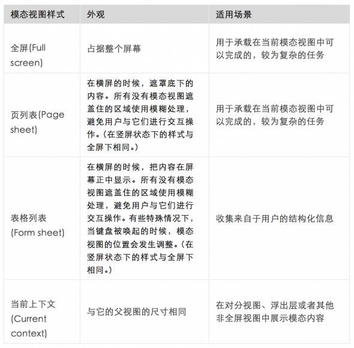

**不要让模态视图覆盖在浮出层之上。**除了警告框外，没有任何元素应该覆盖在弹出层上面。除非极其少有的情况下，用户在弹出层内进行的操作结果必须要以模态视图的形式展现，即便是这个时候，也请先将弹出层关闭，再出现模态视图。

**确保你的模态视图看起来与你的app的整体视觉风格相协调。**举个例子，如果一个模态视图中含有导航条和取消或完成任务的按钮，这里的导航条样式应该与你的 app 中导航条一样。

**合适的话，在模态视图里加入可以说明任务内容的标题。**你可能还需要在模态视图里加入一些补充文字，来清楚地阐明任务内容，并提供一些任务指南。

**选择一个适当的过渡动画来展示模态视图。**使用与你的 app 一致的过渡动画，让用户可以准确地理解当前页面内容的转变与模态视图的出现。关于这一点，你可以指定以下任意一种过渡动画：

- **垂直出现(Vertical)**.模态视图从底部边缘滑入屏幕，也同样从屏幕底部滑出（默认模式）。
- **弹出(Flip)**.当前视图从右往左水平滑动，露出模态视图。从视觉上看，模态视图好像原来就处于当前视图的下面，当前视图移开时，它便出现了。离开模态视图时，原先的父视图从左边滑回屏幕右边。
**如果你要改变当前的过渡动画样式，请确保这种改变对于用户而言是有用而且有意义的。**用户很容易便能感知到这些改变，还会认为这些改变存在特别的意义。最好能设计出一种符合逻辑并始终保持一致的过渡方式，让用户容易感知并且记忆。在没有充分理由支持的情况下，最好不要改变这些默认的过渡方式。